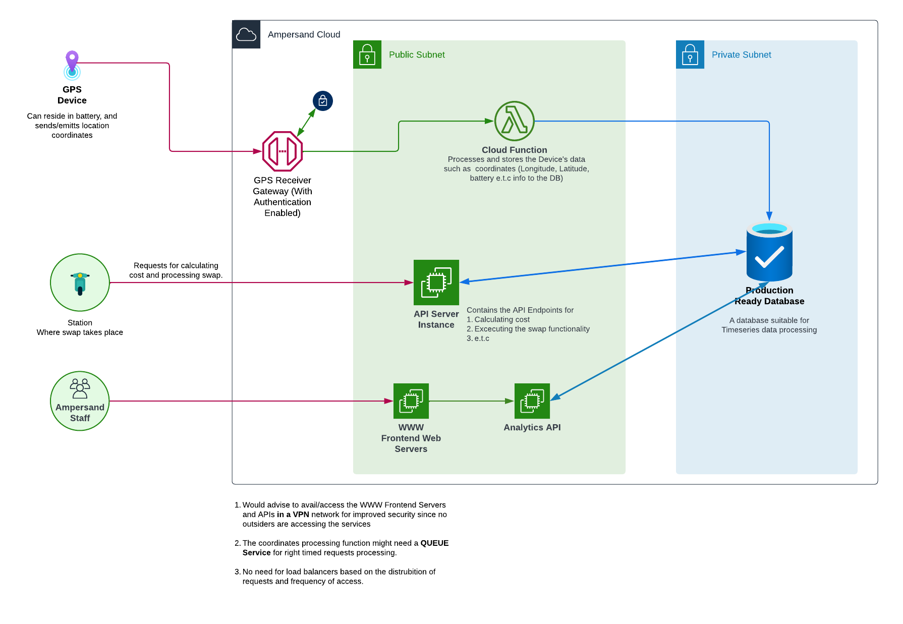

<p align="center">
  <a href="http://nestjs.com/" target="blank"></a>
</p>

[circleci-image]: https://img.shields.io/circleci/build/github/nestjs/nest/master?token=abc123def456
[circleci-url]: https://circleci.com/gh/nestjs/nest

  <p align="center">A progressive <a href="http://nodejs.org" target="_blank">Node.js</a> framework for building efficient and scalable server-side applications.</p>
    <p align="center">
<a href="https://www.npmjs.com/~nestjscore" target="_blank"></a>
<a href="https://www.npmjs.com/~nestjscore" target="_blank"></a>
<a href="https://www.npmjs.com/~nestjscore" target="_blank"></a>
<a href="https://circleci.com/gh/nestjs/nest" target="_blank"></a>
<a href="https://coveralls.io/github/nestjs/nest?branch=master" target="_blank"></a>
<a href="https://discord.gg/G7Qnnhy" target="_blank"></a>
<a href="https://opencollective.com/nest#backer" target="_blank"></a>
<a href="https://opencollective.com/nest#sponsor" target="_blank"></a>
  <a href="https://paypal.me/kamilmysliwiec" target="_blank"></a>
    <a href="https://opencollective.com/nest#sponsor"  target="_blank"></a>
  <a href="https://twitter.com/nestframework" target="_blank"></a>
</p>
  <!--[](https://opencollective.com/nest#backer)
  [](https://opencollective.com/nest#sponsor)-->

## Description

[Nest](https://github.com/nestjs/nest) framework TypeScript starter repository.

## Installation

```bash
$ npm install
```

## Running the app

```bash
# development
$ npm run start

# watch mode
$ npm run start:dev

# production mode
$ npm run start:prod
```

## Test

```bash
# unit tests
$ npm run test

# e2e tests
$ npm run test:e2e

# test coverage
$ npm run test:cov
```

## Routes & Documentation

After startin the server with npm run start:dev <br>
Visit http://localhost:3000/docs for simple swagger documentation

```bash
http://localhost:3000/docs
```

<br>

## **Design & Documentation**



### **The above Infrustructure Design** **consists**:

- A GPS Emitter
- A cloud API gateway/endpoint that acts as a trigger to a cloud function (In this scenario AWS)
- Main API Service (Micro for calculations and swapping)
- Frontend Web analytics server
- Analytics API
- Time series optimized database

##### Data Organization:

- Ideal database would be a database optimized for time series data, and also supports relationships (More like a relational time series optimized database) \
  (For easy of API prototyping I used a MongoDb cluster hosted on MongoDb Atlas) \

- Would store data in a time series manner for tracking batteries
  - Staff (Ignored in implementation)
    - ID (Staff ID)
    - Names
    - Registered At
  - Station
    - ID (Station ID)
    - Station Name
    - Station Location
    - Station Coordinates
  - Swap
    - ID (Swap ID)
    - Swap (In/out)
    - Date & Time
    - Battery ID (Reference)
    - Station ID (Reference)
    - Staff ID (Reference)
    - Driver ID (Reference)
    - Battery Power
    - If swap in
      - Charge
      - Power used
      - Distance (calculated distance traveled)
  - Battery Track
    - ID (Tracking ID)
    - Battery ID
    - Date & Time
    - Coordinates
    - Driver (Reference to a driver)
    - Swap(Reference to a swap)

<br>

#### **Key Risks**

- Some motorcycles GPS coordinates might change while they are not being rode/driven, for example being transported over a moto carrier trailer. \
  In this scenario it might be ideal to have the ability to track the bike’s state too if it is **ON** or **OFF.** \* In this case data would be in terms of series of journeys \
  A journey being a series of coordinates
- If the drivers have the ability to exchange the batteries among themselves, this would lead to probably some miscalculated data.
  - We can solve this by focusing on major metrics and base them on batteries rather than bikes or if possible track the bike’s ID too.
- Data compliance mechanisms in place.

<br>

### **Calculating Distance in**

To calculate the distance in meters or kilometers that a GPS device has traveled, we can use the Haversine formula, which is a mathematical formula used to calculate the distance between two points on a sphere (in this case, the Earth).

Here is the theory behind the algorithm [https://en.wikipedia.org/wiki/Haversine_formula](https://en.wikipedia.org/wiki/Haversine_formula).

While using memoization, storing previous calculations, we can do coordinate per next coordinate calculation until they are done being calculated. This would have to be sorted in terms of time that they were recorded in.

<br>

### **Predicting and Optimizing how many batteries should be at a given station**

- We can use a machine learning model suitable for predicting or forecasting since the data itself is so based on time series.
- With consideration of variables like
  - Time it takes to charge a battery
  - Time of swaps
  - How a day starts (With how many fully charged batteries e.t.c)
  - But overall this would focus on how many swaps happen at a certain station or historical data of battery swaps at each station

<br>

## License

Nest is [MIT licensed](LICENSE).
